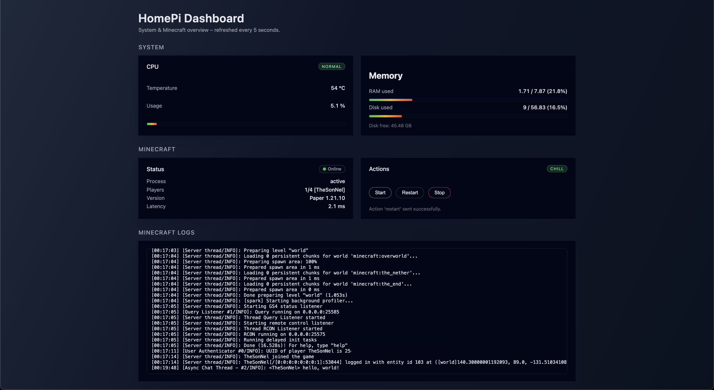

# HomePi Dashboard

A lightweight monitoring and control dashboard for my Raspberry Pi 5 and Minecraft server.
Built with **SvelteKit**, **FastAPI**, and **systemd**.

## Features

### 🔧 *System Monitoring*
- CPU temperature & usage  
- RAM and disk usage  
- Auto-refresh every 5 seconds  

### *Minecraft Management*
- Start / Stop / Restart the server (via systemd)  
- Live server status (online/offline, latency, players, version)  
- Activity snapshot (CPU/RAM/mood)  
- Log tailing (polling-based with auto-scroll)

## Build & Deployment

The dashboard is deployed automatically to the Raspberry Pi using a **self-hosted GitHub Actions runner**.

Pipeline:
1. Any push to `master` triggers a build (`npm ci && npm run build`)
2. The runner copies the generated SvelteKit `build/` folder into the backend at: `public/`
3. The backend systemd service is restarted

The backend repository lives here:  
➡️ **https://github.com/NelsonEU/homepi_dashboard_api**

## Screenshot

